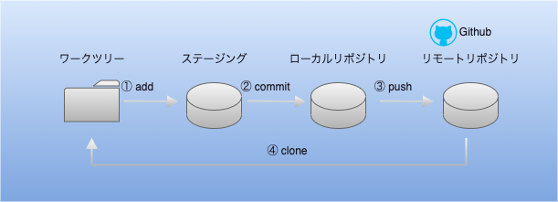

# はじめに　
Gitを用いたチーム開発のイメージ、コマンドを記録に残す（自分用）  
  
<br>

# Gitとは
* ソースコードを初めとファイルの変更履歴（バージョン）を管理するためのシステム
* ファイルの追加や変更の履歴情報を管理することで、過去の変更箇所を確認する、特定時点の内容に戻すことができる為、チーム開発で主流となっている

<br>

# 用語解説
* リポジトリ  
ソースコードや変更履歴などの情報が納められたデータベースのこと  
リポジトリには２種類あり、用途は以下の通り
    * リモートリポジトリ  
    複数人で共有するためのリポジトリ
    * ローカルリポジトリ  
    手元のPCにある自分専用のリポジトリ

* ワークツリー  
手元のPCにある領域で、実際に作業するディレクトリーのこと

* インデックス（ステージング）  
手元のPCにある領域で、ローカルリポジトリへコミットする準備をするための領域
ステージングエリアとも呼ぶ

参考  
https://and-ha.com/coding/beginners-guide-basics-git/

<br>

# 操作
### アップロード操作　　


#### ① addコマンド  
ワークツリーで作成・更新したソースコードをインデックス(ステージング)へ登録するためのコマンド  
インデックス(ステージング)へ登録しないと、ローカルリポジトリーへコミットされない  
<br>
実際にコマンドは以下です  

```
$ git add ファイルパス
$ git add . #カレントディレクトリにあるファイル全てを登録する場合
$ git add articles/a8bd67031791d5.md #特定のファイルのみ登録する場合
```
<br>
git statusコマンドにて、現在のインデックスへの登録状況を確認  

```
$ git status ファイルパス
```
* Changes to be committed(コミットされるべき変更)  
新規作成したファイルで、まだローカルリポジトリへコミットされていない状態
* Changes not staged for commit  
ローカルリポジトリへコミットした後に、更新のあったファイル
* Untracked files(gitで管理されていないファイル)  
ワークツリーに存在するがインデックスに登録されていない状態


#### ② commit
ステージングに上げられたファイルやディレクトリの追加変更をローカルリポジトリへ反映するためのコマンド  
コミットは時系列順に繋がった状態でリポジトリに格納される  
変更を辿ることで過去の変更履歴やその内容を知ることができる  
<br>
実際にコマンドは以下です  

```
$ git commit -m "コミットメッセージ入力"
$ git commit -m "テスト"
```


git logコマンドにて、正常にコミットされたことを履歴から確認する

```
$ git log
```
* 上段　コミットメッセージ　"テスト"で正常にコミットされ、履歴に登録されていることが確認できる  
* 下段　過去にコミットされた履歴も時系列順に確認できる  


#### ③ push
ローカルリポジトリの更新履歴をリモートリポジトリへアップロードするためのコマンド  
<br>
実際にコマンドは以下です  

```
$ git push origin main
```


# おわりに
ブランチやマージ、リストアコマンドを使用し学びを得たら追記していく
